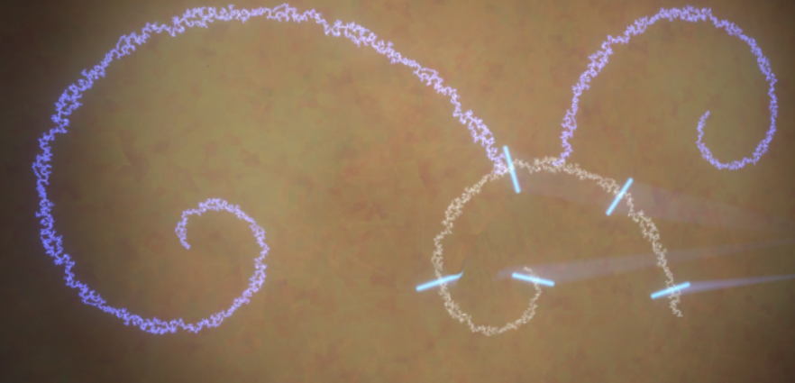

# French-Nomaian
A nomai's language generator adapted for french.

# Context

There is a game called [outer wilds](<https://store.steampowered.com/app/753640/Outer_Wilds/>), a game which is
> about astronauts [doing things] in space, doing archeology, ~~astrology~~ astronomy and science, with the gameplay itself consisting mostly of navigatgion in various 3D spaces with your legs or your trusty spaceship. There are interesting characters and tantalizing mysteries. [...] This story is about curiosity, courage, death, rebirth, and the terrifying vastness of space. The game can induce agoraphobia, claustrophobia, fear of heights, fear of depths and that which is unseen or hidden.
>
> \- riddlesandlies on tumblr.

 But, most importantly, for many of us... outer wilds is an experience. Outer wilds is a unique game loaded with charming characters and a **lot** of emotions; and if you haven't played it : _Stop what you're doing and go play it_ (preferably without looking anything about it).

 # Description

More specifically, this game is about  finding more about the nomais, an ancien alient spieces that dewelled in our solar system long ago.\
The nomais had a way of communicating that was not linear like french or english is. On the contrary, their writing system was composed of spirals that could connect one to another.

|  |
|:---------------------------------------------------:|
| _an exemple of a nomai writing. Credit to [emmaw219602](https://steamcommunity.com/sharedfiles/filedetails/?id=2904939346) for their original screenshot (contains spoilers)_|

Several people already worked on the elaboration of a real, functional nomai writing system. After a brief research, I stumbled upon :
- [36CornDog](https://www.reddit.com/r/outerwilds/comments/15fj6yu/took_a_shot_at_a_nomai_writing_system/) who had created a "language model"
- [YanWittman](https://github.com/YanWittmann/ow-written-nomai-lang) and [evanfield](https://github.com/evanfields/NomaiText.jl) who had created language generator from english to nomaian.

The three projects are already very good on their own, however each somewhat lacked something. Without taking into account the language model, yan's project was great, and based itself on 36CornDogs solution, however, their way of creating a spiral could be improved. On the other hand, evanfields [web program](https://nomai-writing.com/) was also great, and while it had a really elegant way of generating the spiral, their symbol generation method itself was problematic; resulting in a 1:X mapping (EN->NO) which is somewhat difficult for someone who would want to translate it back.

As such, I decided to combine those two projects together using my favourite programming language. \
What I will be taking from each project is as following :
- 36CornDogs : the language model consisting of the genral rules and the consonants/vowels/numerals to nomaian's glyph table, which I will adapt to the french language using [a french version of cmudict](https://github.com/mmemim/OpenUTAU-French-Dictionary).
- YanWittman : I will keep the way of reading and organizing the glyphs, namely three separated ligns for numerals (include punctuation), vowels, consonants in this respective order of reading. For a part of the spiral, the three ligns should be
\-·-·-·-·-·-·-·-· => vowels\
\-·-·-·-·-·-·-·-· => consonants\
\-·-·-·-·-·-·-·-· => numerals\
I will also keep the way of translating using phonems.
- evanfields : I will keep the way of creating the spiral and the "3-way" method of the GlyphGrid for organizing information.

