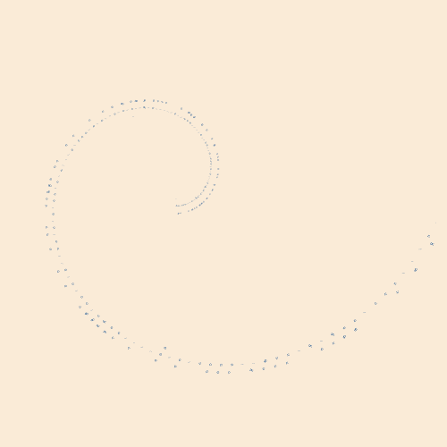

# French-Nomaian


# Context

There is a game called [outer wilds](<https://store.steampowered.com/app/753640/Outer_Wilds/>), a game which is
> about astronauts [doing things] in space, doing archeology, ~~astrology~~ astronomy and science, with the gameplay itself consisting mostly of navigatgion in various 3D spaces with your legs or your trusty spaceship. There are interesting characters and tantalizing mysteries. [...] This story is about curiosity, courage, death, rebirth, and the terrifying vastness of space. The game can induce agoraphobia, claustrophobia, fear of heights, fear of depths and that which is unseen or hidden.
>
> \- riddlesandlies on tumblr.

 But, most importantly, for many of us... outer wilds is an experience. Outer wilds is a unique game loaded with charming characters and a **lot** of emotions; and if you haven't played it : _Stop what you're doing and go play it_ (preferably without looking anything about it).

But more specifically, this game is about finding more about the nomais, an ancien alient spieces that dewelled in our solar system long ago.
The nomais had a way of communicating that was not linear like french or english is. On the contrary, their writing system was composed of spirals that could connect one to another.

|  |
|:---------------------------------------------------:|
| _An exemple of a nomai writing. Credit to [emmaw219602](https://steamcommunity.com/sharedfiles/filedetails/?id=2904939346) for their original screenshot (contains spoilers)_|

# Description

## Credits

Instead of saying each time what parts I took from where, I prefered to dedicate a full sub-section to the people that made this project possible.
Thus, I want to thank [36CornDog](https://www.reddit.com/r/outerwilds/comments/15fj6yu/took_a_shot_at_a_nomai_writing_system/) from who I took the
language model in order to create my french nomaian dialect.
I also want to thank [YanWittman](https://github.com/YanWittmann/ow-written-nomai-lang) and [evanfield](https://github.com/evanfields/NomaiText.jl)
who have already created fully functionnal projects that I could rely on and that I encourage you to go check out.

## Project

The goal of this project is to create a full-fledged french/nomai translator.
But not only did I want to generate nomai sentences like other projects did before
me, but I also wanted to be able to do the inverse : To translate back to french.
Moreover, I wanted the whole of it to be usable as is, and thus to create an
interface that could be used to do those operations.

As of now, the binary file must be executed in the ./bin folder, but I will
make it possible to execute it elsewhere in another version.

It very much possible that some sentences you will wrote will display warnings like so :\
Warning : <X> is not in the dictionnary. Please consider adding it.

It is because the dictionnary used does not contain your word. If this is the
case, I encourage you to submit a merge request so that we can collectively make
this dictionnary grow.

# Build

## Ada

French Nomaian is a mostly Ada project (with a little bit of C) built with Alire.
As such, one must install Alire to be able to build it. You can download it [here](https://alire.ada.dev/)
and follow the installation procedure [here](https://alire.ada.dev/docs/).

Apart from alire, the project use several dependencies that can be added if nedded
with the ```alire with <X>``` command and that are shown below.

|  |
|:---------------------------------------------------:|
| _The project's dependency graph_|

## C

However, this project also use a bit of C in order to create a basic TUI.
As such, to build the project, you also need to install ncurses librairies.
To do this, simply use\
``` sudo apt-get install libncurses5-dev libncursesw5-dev```

## Run

To build the project, please use ```alr build``` and the execute the projet in the
./bin folder.

# Project's details

The project is composed of several parts, which are :
- The TUI
- The Model
- The drawing

## TUI

|  |
|:-----------------------------------------:|
| _The project's interface_|

Using the C ncurses library, I was able to create a basic TUI interface to input
user data. This was done by interfacing a C file to Ada using the Interfaces.C module.
The interface can be seen [here](./src/tui/ncurses_interface.ads).

This way of inputting sentences is better than CLI for numerous reasons. Not only
is it aesthetically more pleasing but, and more importantly, it handles french
characters better. In using CLI (with Ada) to input sentences when the project
first started, I had to input quotation marks (") at the start and end of each
sentences. This was because otherwise apostrophes would be interpreted
as string delimiters and would bug the program. Using the TUI, no such things
are required anymore.

## Model

# Encoding

To translate a sentence into nomaian, this project use a process of 2 steps :
- Sentence to Phonems
- Phonems to Glyphs

## Sentence to Phonems

The first step is decomposing the input sentence into phonems.
As described by Wikipédia, phonems are
> [...] any set of similar speech sounds that is perceptually regarded by the
speakers of a language as a single basic sound—a smallest possible phonetic unit—
that helps distinguish one word from another.

This is useful because it allows for a 1.5:1 mapping between french and its nomaian
dialect while being computationally efficient as the mapping can be put into a Hashmap.

As an example, let us take a sentence that will serve us as example throughout this
section. Let's say that I want to translate the sentence "Il y a plus à découvrir ici." [1].

This step will transform this sentence into its corresponding phonems. As such,
it will go from,\
```Il y a plus à découvrir ici.```\
To\
```ii ll | yy | aa | pp ll uu | aa | dd ei kk ou vv rr ii rr | ii ss ii . |```

There is several points to note here.
First, as you can see, vertical bars have been added by this step. This is to
delimitate between words as this "word separator" has its own glyph to translate to.
Then, phonems are doubled. This is because, the dictionnary that I used -
[OpenUtau](https://github.com/mmemim/OpenUTAU-French-Dictionary) - uses
this convention to write phonems.
Finally, one could refute me : " but those aren't phonems ". I know. I'm not a
linguistic major. I kept using this term as it is the first term I encountered
when starting this project.

[1] In english : There's more to explore here.

## Phonems to glyphs

### Simplification

Now that we have our phonems, it it time to translate them to actual glyphs.
But first, we still need to transform our data a bit more. In order to
transform phonems to glyphs, I created yet another hashmap - a " language model " -
that could realize this mapping. However, this map only translate "single" phonems
to glyphs. That is to say, for example, "a" becomes "squareline".
Thus, before becoming glyphs, our sentence has to be simplified into,\
```i l | y | a | p l u | a | d ei k ou v r i r | i s i .```

This step, while useless in itself - as I could have done the unsimplified phonems
to glyphs mapping directly - is mainly because it is easier to read when programming
both the language model and debugging.

## Glyphs

For there on, we can go through our sentence and construct a three-branches graph
that will hold the informations.

### Language model

As said before, a language model was devised so that we could encode each phonems
into glyphs. A screenshot of the model can be seen below.


|  |
|:-----------------------------------------:|
| _The sections are "line bend square penta hexa hepta octa". To read a consonant read the line, and then the column. For the vowel/numeral, do the inverse._|

As we can see, this model is symmetric along its main diagonal. This is done to
be more efficient. Indeed, instead of encoding each phonem separately, this
allows one to use three times the same symbol and to distinguish its
meaning knowing where it stands (see the following sub-section).

This language model was also devised so that rarer phonems (according to openUtau)
would be encoded with glyphs that would take more space.
Indeed, following basic information theory, it is more efficient like so
(at least spatially).


### Graph

Without going to much into the implementation details, each graph's node is a
record composed of a type T {n[umeral], v[owel], c[onsonant], s[eparator]}
representing what unit it is, a numeral being either punctuation or a number.
There is also a GlyphName which is its corresponding phonem.

In this graph, glyphs are distributed along three mains axis:


Which allows - as we saw before - for some redundancy.

In our case, the glyphs' linear representation of our sentence is\
```squaresquare(v) line(c) linedotline(s) pentapenta(v) linedotline(s) squareline(v) linedotline(s) pentabend(c) line(c) hexabend(v) linedotline(s) squareline(v) linedotline(s) pentaline(c) hexapenta(v) squarebend(c) heptaline(v) hexa(c) bend(c) squaresquare(v) bend(c) linedotline(s) squaresquare(v) square(c) squaresquare(v) bend(n)```

## Drawing

Those are not the final images

\
\
\


From top to down :
- _Si le sexe devenait une catégorie dépendante du genre, la définition même du genre comme interprétation culturelle du sexe perdrait tout son sens. - Trouble dans le genre; J. Butler_
- _Quand on est un Blanc, jouer aux Indiens et faire du recel de biens culturels mal aqcuis revient au même. - L'opposé de la blancheur; L. Miano_
- _Les lesbiennes ne sont pas des femmes. -La pensée Straight; M. Wittig_
- _Lorsque cette opération de genre grammatical générique est réalisée à la faveur du masculin, elle ne choque en aucun cas le patriarcat en place[,] l'inverse déclenche en revanche des vagues d'indignation. Si l'usage du féminin neutre est si controversé, c'est qu'il démontre de mon point de vue l'impossibilité de cette prétendue neutralité. -La typographie post-binaire; C. Circlude_

 Translation :
 - _It would make no sense, then, to define gender as the cultural interpretation of sex, if sex itself is a gendered category. -Gender Trouble; J. Butler_
 - _When you're White, pretending to be Indians and receiving stolen cultural goods are the same things. -The Opposite of Whiteness; L. Miano_
 - _Lesbians are not women. -The Straight mind; M. Wittig_
 - _When this generic grammatical gender operation is done to the favour of the masculine, it does not shock the patriarcal society in power[,] the inverse
 however, creates waves on indignation. If the feminin as neutral is so controversial, it is very much because, in my opinon, it demonstrates very well
 that this alledged neutrality is impossible. -The post-binary typography; C. Circlude_

## Spiral

Following the construction of such a model, one can now draw this graph.

The main way to draw the spiral is by using polar coordinates to draw a [golden spiral](https://en.wikipedia.org/wiki/Golden_spiral).\
By getting the depth of the graph (N), which is the length of the main branch, and
the current depth of the i-th symbol (I), one can use this information to derive
an angle and a radius, which can then be used to plot our glyph using the
following formula,

|  |
|:------------------------------------------------------:|
| _k(N) is used to adapt the angle to the spiral length. s(N) increase the radius._|

|  |
|:------------------------------------------------------:|
| _espilon(N) is used to adapt the distance to the spiral depending on the spiral length._|

|  |
|:------------------------------------------------------:|
| _Remarks how the Y-axis is inverted. This is because Cairo use its axis pointing down._|


The gradient is inserted here because it allows us to create other branches.
By computing a local gradient and then orienting it towards the exterior / interior
of the spiral depending on the branch, I can finally displace the glyph.

## Linear

There still exist in the code a linear version of the translation. I didn't
added it because it is somewhat wobbly, and because I first implemented it
following evanfields methodology, without fully understanding it.\
In a futur version, I will make it more robust.


# Lesson for me :
- Most important of all, start your project with a simple example - a model of sorts - whenever possible.
Here, I could have started with the model (the draw_fibionnaci_spiral function), so that I could know what to implement next in a more complex environement.

- Also, as one of my partner once said - was she quoting from someone ? I don't
remember that much - "Everything's first day is terrible". Refactor only when
you have a working example **and** that you have commited previous draft work.
Do not do the inverse process of wanting to optimize everything first, which is
a tendenccy I have.

- Finally, try to plan ahead a bit more than what you did. You did well doing
the five major steps, but you could have gone into a bit more details about
the printing one _before_ coding it.

